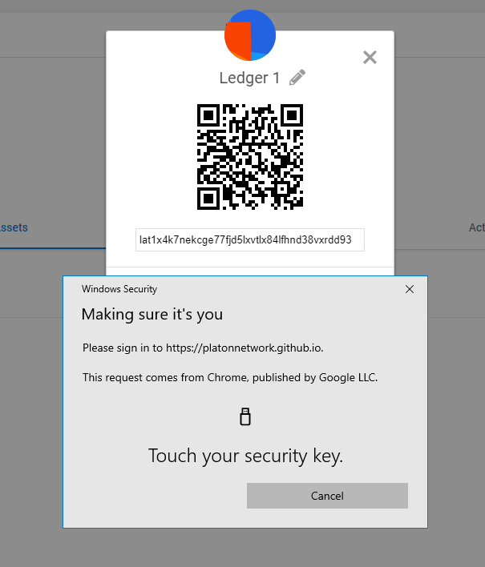
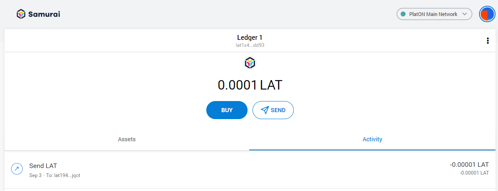

# How To Use Your Ledger Device With The Samurai Wallet

## Introduction

A Ledger Device is a hardware wallet that is considered one of the most secure ways to store your digital assets. Ledger uses an offline, or cold storage, method of generating private keys, making it a preferred method for many crypto users. This guide will help you to connect your Ledger device to the Samurai Wallet. The Samurai Wallet enables you to Send and Receive LAT with the Ledger Device.

## Quick Links

Before You Start, Make Sure
Install The PlatON App
Connecting to the Samurai Wallet
View Account Balance
Receiving LAT in the Samurai Wallet
Sending LAT in the Samurai Wallet
Support

## Before You Start, Make Sure:

1. You’ve initialized your Ledger Device.
2. The latest firmware is installed.
3. Ledger Live is ready to use.
4. Install the latest version of Samurai Wallet

## Install The PlatON App

1. Open the Manager in Ledger Live.
2. Connect and unlock your Ledger Device.
3. If asked, follow the onscreen instructions and Allow Ledger Manager.
4. Find PlatON in the app catalog.
5. Click the Install button.
   An installation window will appear.
   Your device will display Processing…
   The app installation is confirmed.
6. Close Ledger Live.

## Connecting to the Samurai Wallet

1. First, connect and unlock your Ledger Device.
2. Open the PlatON App on your Ledger Device

Ledger Nano S will show "PlatON" and “Application is ready”

3. Open the Samurai Wallet Application and click "Get Started".

   

4. Choose a way to use this wallet.

5. Click"I agree".

6. Type in the password and check the Terms of Use.

7. Back up this Secret.

8. Switch the network to PlatON Main Network and click the headphoto to open the menu. Click "Connect Hardware Wallet".

9. Click Ledger Icon and click Connect button.

10. Choose a wallet to unlock and import to Samurai Wallet.

11. Click the right button and click Account details.

12. Verify that the address on the Samurai Wallet matches the address on your Ledger Device.

    

## View Account Balance

Your account balance is shown on the middle position of the Samurai Wallet.

## Receiving LAT in the Samurai Wallet

1. Make sure you have verified your Receive address as shown in Step 11 and 12 of “Connecting to the Samurai Wallet”.

2. You can get your Receive address by simply copying the address to the clipboard or by scanning the QR Code.
   a. You can copy the address by clicking the  button next to the address.

   b. To scan the QR Code, click the right button at bottom of headphoto, and click the "Account details" button. It will show an QR Code to scan, please verify that the address matches after you have scanned. Click the right-top close button to go back to the Main page.

3. Once you have sent LAT from another Wallet, your LAT balance will update. 

## Sending LAT in the Samurai Wallet

1. Click the “Send” button.

2. Enter the LAT address and the Amount, then click the “Next” Button

3. Review the Amount you are sending and the Fees for the transaction and click the “Confirm” Button.

4. Review and sign the transaction on your Ledger Device.

For ledger Nano S:

Press the right button on your Ledger Device to review the transaction details (Amount and Address) until you see “**Accept and send**”.

Press both buttons on your Ledger Device to sign the transaction.

5. Once you approve the Transaction on the Ledger Device, the transaction will be sent and a transaction record will appear in the Activity. (Please wait approximately 2 minutes for the transaction to confirm).

## Support

Telegram: https://t.me/PlatONNetwork

GitHub Issue: https://github.com/PlatONnetwork/Samurai/issues

