## Samurai使用教程

### 1. 安装

+ 从[官方地址](https://github.com/AlayaNetwork/Samurai/releases/download/v8.0.10/samurai-chrome-8.0.10.zip)下载Samurai插件包
+ 解压Samurai插件包
+ 打开chrome浏览器，在地址栏输入并回车，进入到chrome扩展程序管理页面。

```
chrome://extensions/
```

+ 打开开发者模式开关，选择加载已解压的扩展程序，选择第2步解压的目录即可


### 2. 创建账号与管理

2.1 点击浏览器地址栏右侧, Samurai的图标，第一次使用时，会出一个提示，如下图：

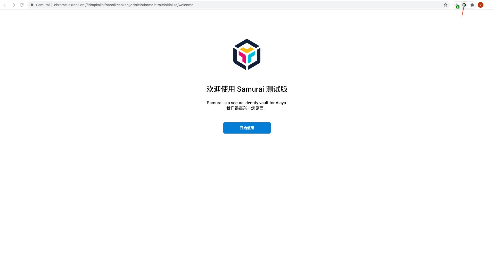

2.2 点击开始使用，接下来有两个选择，可以创建钱包也可以导入钱包

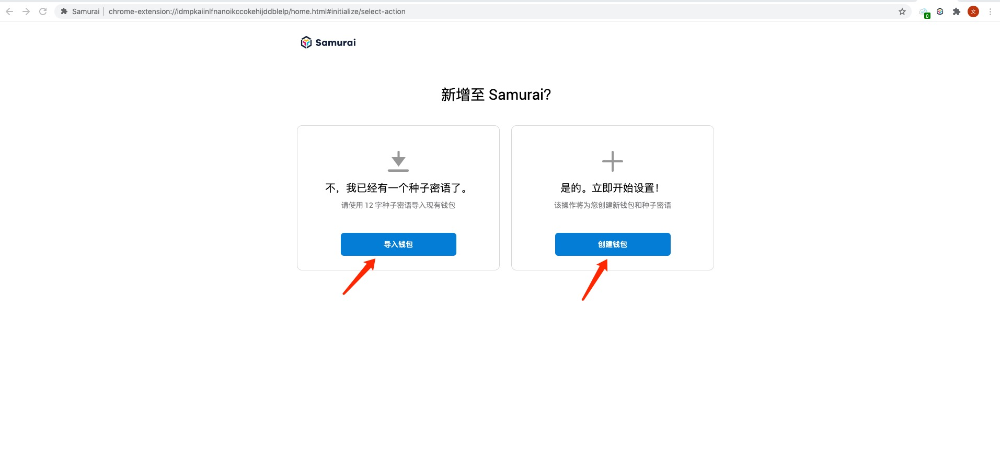

+ 导入钱包：点击导入钱包，进入引导页，点击I agree进入下步即可。然后输入钱包的助记词以及密码，然后点击导入->全部完成即可进入主界面

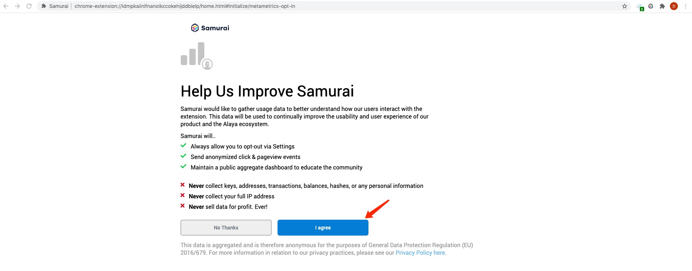

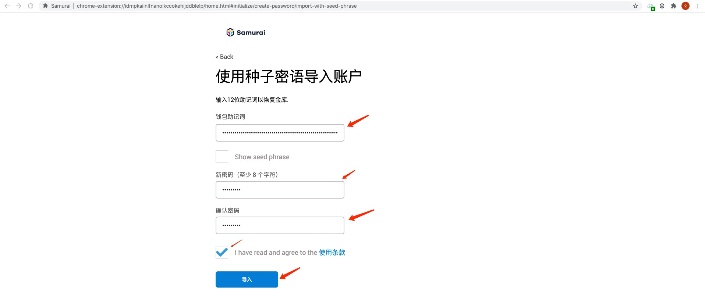

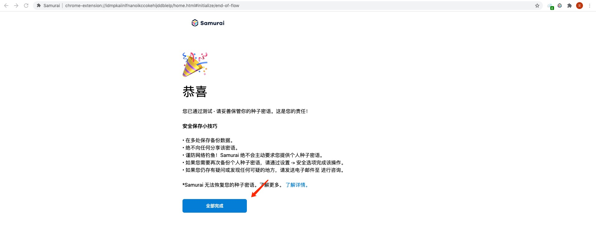


+ 创建钱包：点击创建钱包，进入引导页，点击I agree进入下步即可。然后输入新钱包的密码，然后点击创建

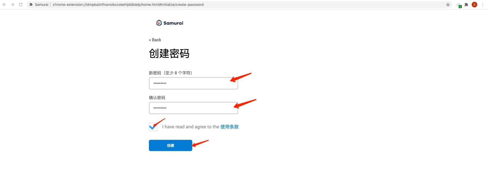

进入助记词备份界面，点击此处显示密语可以显示新建账户的助记词(助记词需要防止被其他人看到, samurai使用您提供的密码在本地加密此信息，且永远不会将其发送到服务器), 点击稍后提醒直接就进入新建账户的samurai主界面。

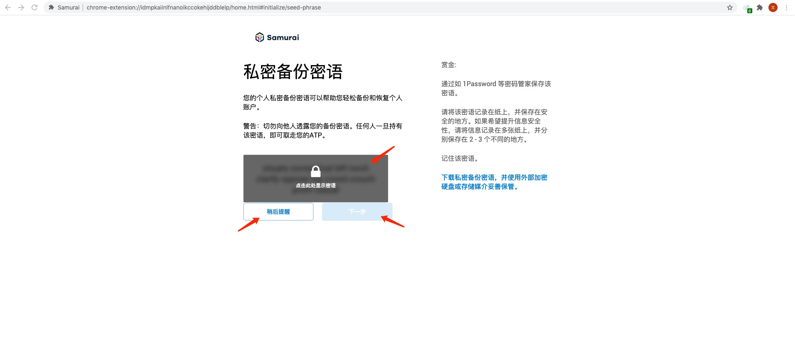

点击下一步，重新输入正确的助记词顺序，点击确认按钮->全部完成即可进入主界面


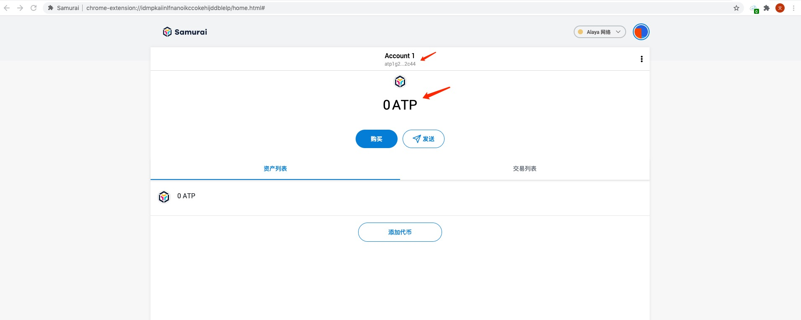

### 3. 交易操作

#### 3.1 发送ATP

+ 在主界面上点击发送按钮，即可弹出添加收件人界面

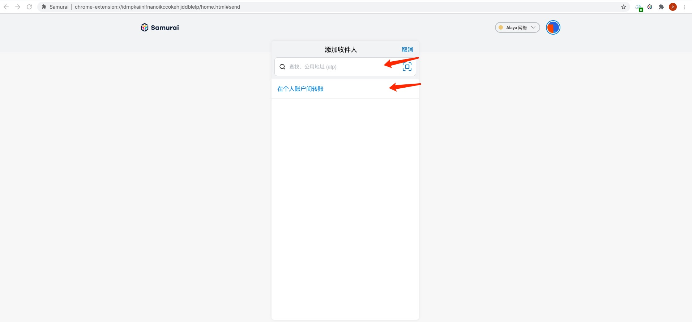

+ 输入或者选择个人账户间转账的地址，进入到交易表单界面：

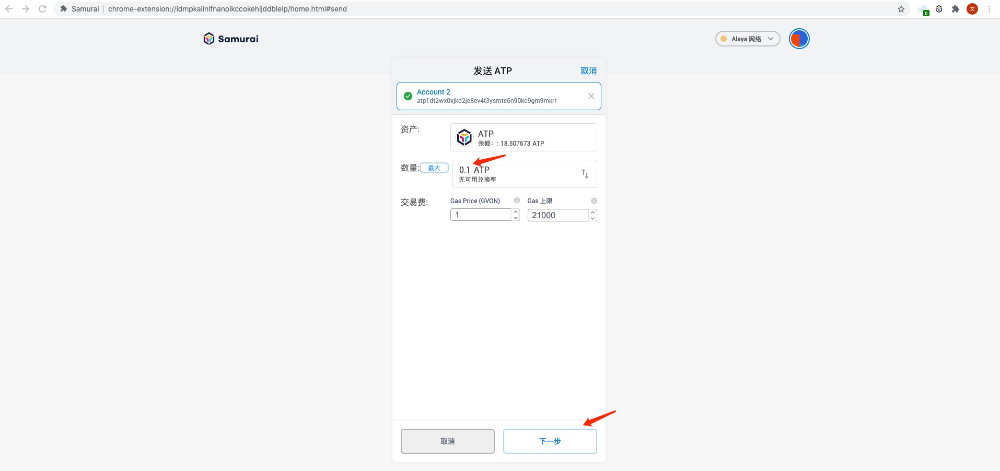

+ 交易表单必须填写交易ATP的数量，系统会给出默认的交易费，当然也可以自己对该值做适当调整，完成表单后点击下一步进入待确认界面，该界面会显示总共花费的ATP数量(包含手续费)

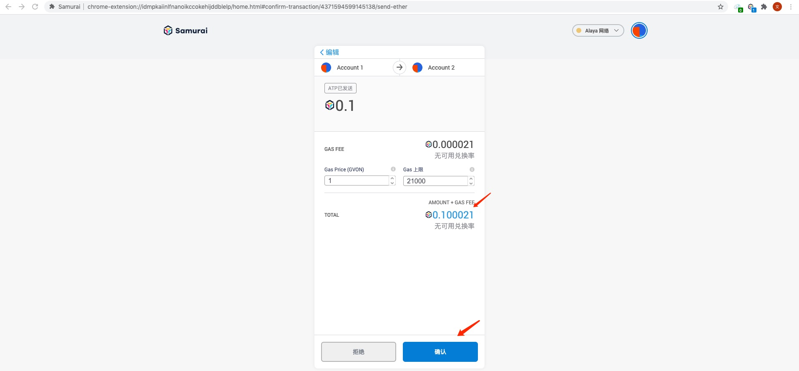

+ 点击确认按钮即可完成ATP的发送，可以在主页面的交易列表中进行查看交易状态

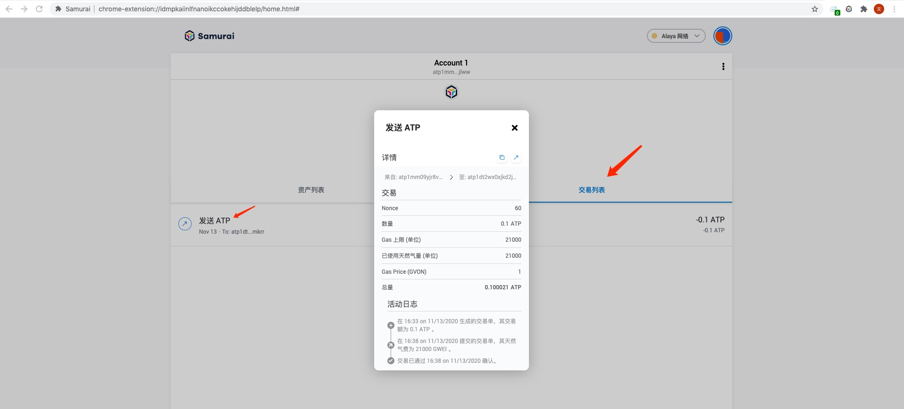

#### 3.2 添加并发送代币

#### 添加代币

+ 进入主页面，点击资产列表->添加代币

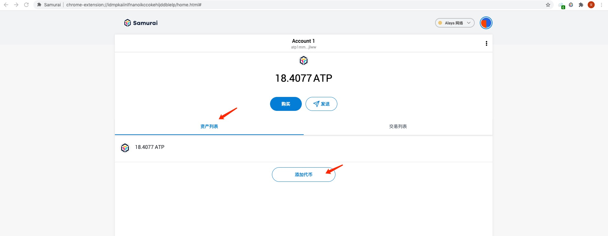

+ 弹出添加代币界面框，添加连接的网络已经存在的代币的合约地址即可，samurai会根据合约地址自动去获取代币的符号和精确小数点，完成后点击下一步

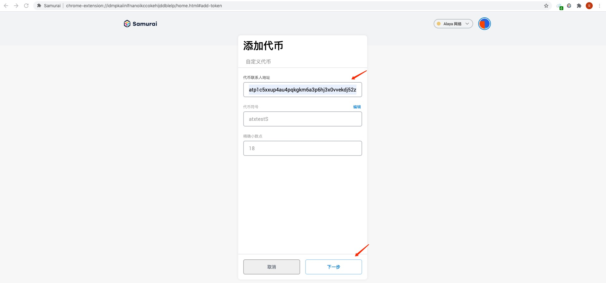

+ 进入添加代币确认界面，界面会显示该账户下该代币的余额，点击添加代币即可添加成功

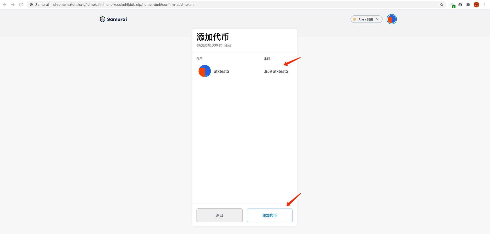

添加成功后转入到该账户代币展示界面，里面显示代币的余额，也可以点击发送按钮进入代币的转账界面，同时主界面资产列表会显示该代币资产。

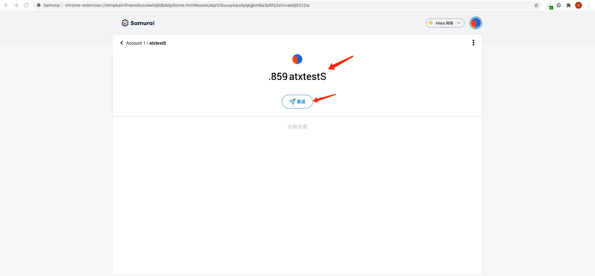

#### 代币转账

+ 可以在账户代币展示界面点击发送按钮发起代币转账，也可以在主界面资产列表界面点击对应代币的SEND按钮发起转账

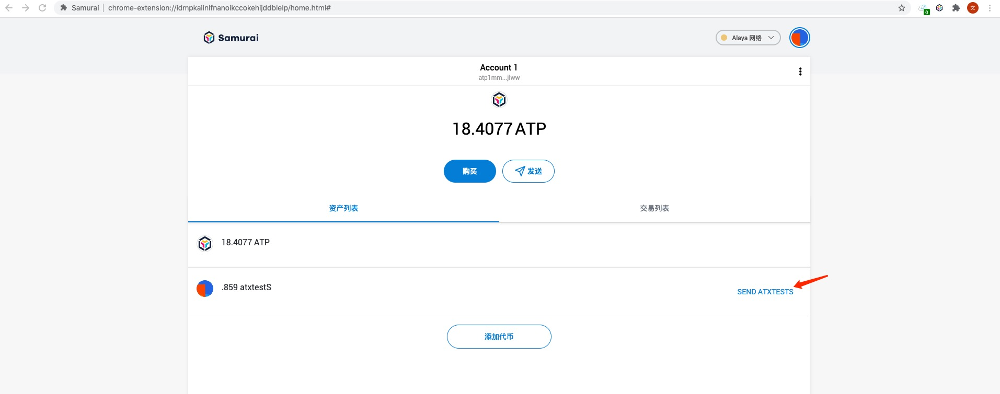

+ 进入添加收件人界面，同发送ATP操作一样输入或者选择个人账户间转账的地址，进入到交易表单界面

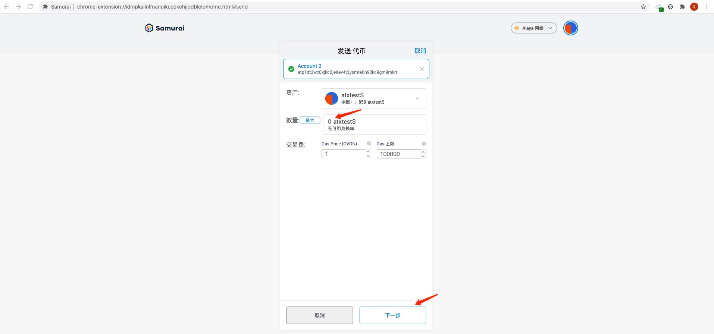

+ 交易表单必须填写交易的代币数量，点击下一步即可进入交易确认界面:

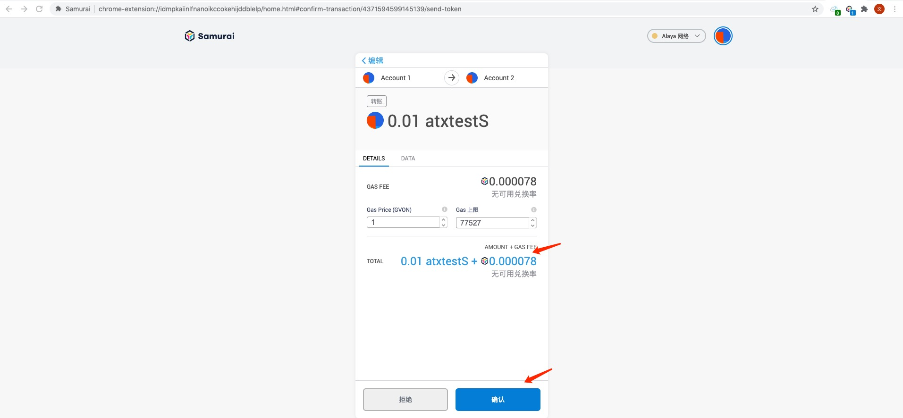

+ 点击确认按钮即可完成代币的发送，可以在主页面的交易列表中进行查看交易状态

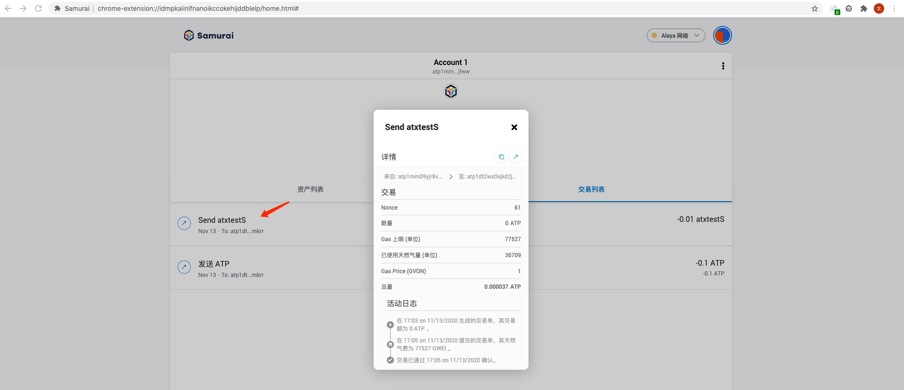

