## Samurai使用教程

### 1. 安装

+ 从[官方地址](https://github.com/AlayaNetwork/Samurai/releases/download/v8.0.10/samurai-chrome-8.0.10.zip)下载Samurai插件包
+ 解压Samurai插件包
+ 打开chrome浏览器，在地址栏输入并回车，进入到chrome扩展程序管理页面。

```
chrome://extensions/
```

+ 打开**开发者模式**开关，选择**加载已解压的扩展程序**，选择第2步解压的目录即可

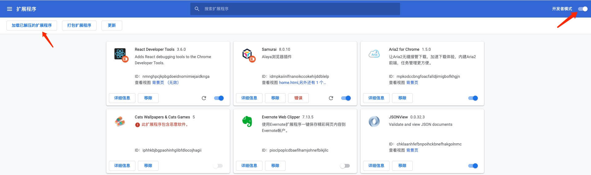

### 2. 初始化

2.1 点击浏览器地址栏右侧, Samurai的图标，第一次使用时，会出一个提示，如下图：


2.2 点击**开始使用**，接下来有两个选择，可以**创建钱包**也可以**导入钱包**


+ 导入钱包：点击**导入钱包**，进入引导页，点击**I agree**进入下步即可。然后输入**钱包助记词**以及**密码**，然后点击**导入**->**全部完成**即可进入主界面


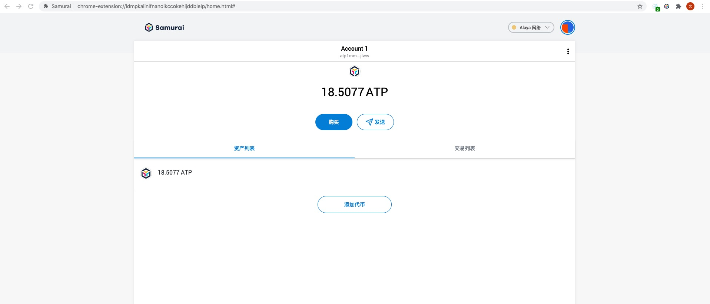

+ 创建钱包：点击**创建钱包**，进入引导页，点击**I agree**进入下步即可。然后输入新钱包的**密码**，然后点击**创建**


进入助记词备份界面，点击此处显示密语可以显示新建账户的助记词(助记词需要防止被其他人看到, samurai使用您提供的密码在本地加密此信息，且永远不会将其发送到服务器), 点击**稍后提醒**直接就进入新建账户的samurai主界面。


点击**下一步**，重新输入正确的助记词顺序，点击**确认**按钮->**全部完成**即可进入主界面

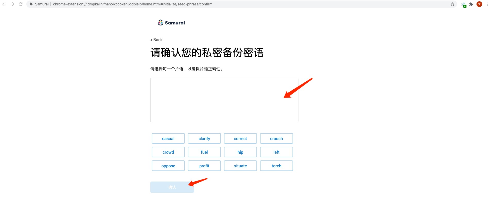


### 3. 交易操作

#### 3.1 发送ATP

+ 在主界面上点击**发送**按钮，即可弹出**添加收件人**界面


+ 输入或者选择**个人账户间转账**的地址，进入到交易表单界面：


+ 交易表单必须填写交易ATP的数量，系统会给出默认的交易费，当然也可以自己对该值做适当调整，完成表单后点击**下一步**进入待确认界面，该界面会显示总共花费的ATP数量(包含手续费)


+ 点击**确认**按钮即可完成ATP的发送，可以在主页面的**交易列表**中进行查看交易状态


#### 3.2 添加并发送代币

#### 添加代币

+ 进入主页面，点击**资产列表**->**添加代币**


+ 弹出添加代币界面框，添加连接的网络已经存在的**代币合约地址**即可，samurai会根据合约地址自动去获取代币的符号和精确小数点，完成后点击**下一步**


+ 进入添加代币确认界面，界面会显示该账户下该代币的余额，点击**添加代币**即可添加成功


添加成功后转入到该账户代币展示界面，里面显示代币的余额，也可以点击**发送**按钮进入代币的转账界面，同时主界面资产列表会显示该代币资产。


#### 代币转账

+ 可以在账户代币展示界面点击**发送**按钮发起代币转账，也可以在主界面资产列表界面点击对应代币的**SEND**按钮发起转账


+ 进入添加收件人界面，同发送ATP操作一样输入或者选择**个人账户间转账的地址**，进入到交易表单界面


+ 交易表单必须填写交易的代币数量，点击下一步即可进入交易**确认**界面:


+ 点击**确认**按钮即可完成代币的发送，可以在主页面的交易列表中进行查看交易状态


### 4. 创建账号与管理

##### 4.1 创建账号

+ 点击samurai主页右侧小图标，然后点击**创建账户**

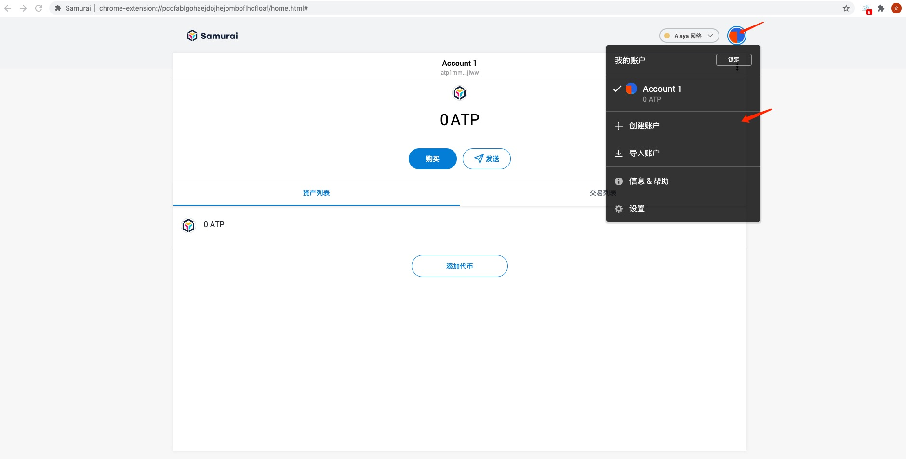

+ 进入创建账户表单界面，输入**账户名称**(下图例子是钱包2)，点击**创建**按钮

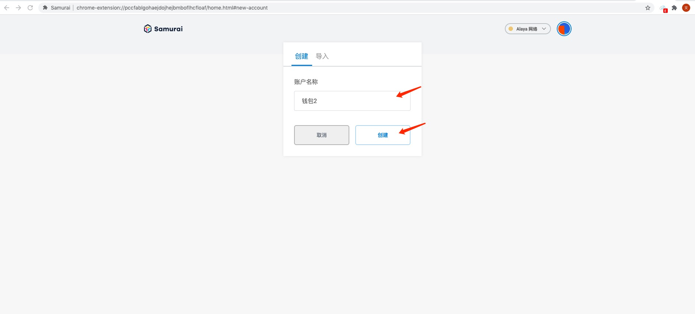

+ 进入主页点击右侧图标查看创建的账户是否存在

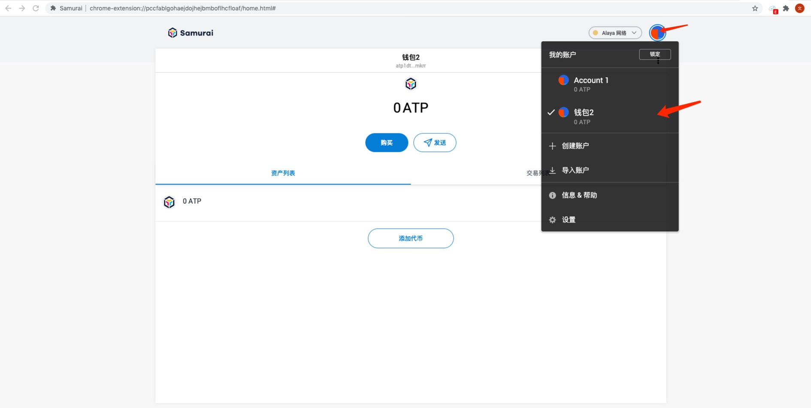

##### 4.2 导入账号

+ 点击samurai主页右侧小图标，然后点击**导入账户**

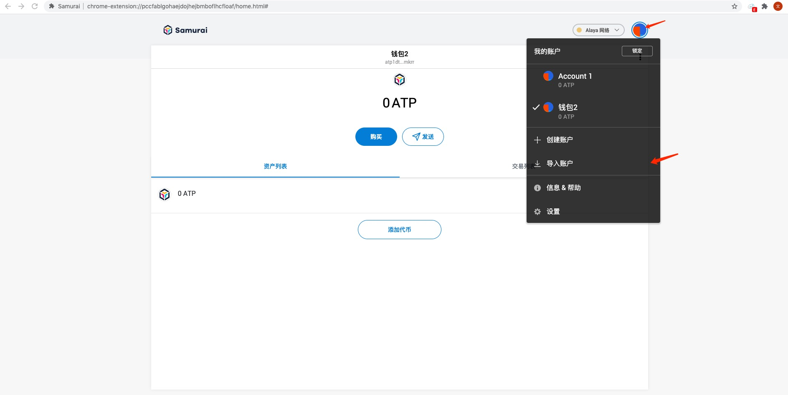

+ 进入导入账户表单界面，可以有两种模式选择(私钥/keystore json文件)，选择私钥模式，将私钥粘贴到表单即可，然后点击**导入**按钮


选择导入keystore文件模式，选择**JSON文件**类型，点击选择文件从本地目录选取keystore文件，然后输入keystore文件的密码口令，然后点击**导入**按钮

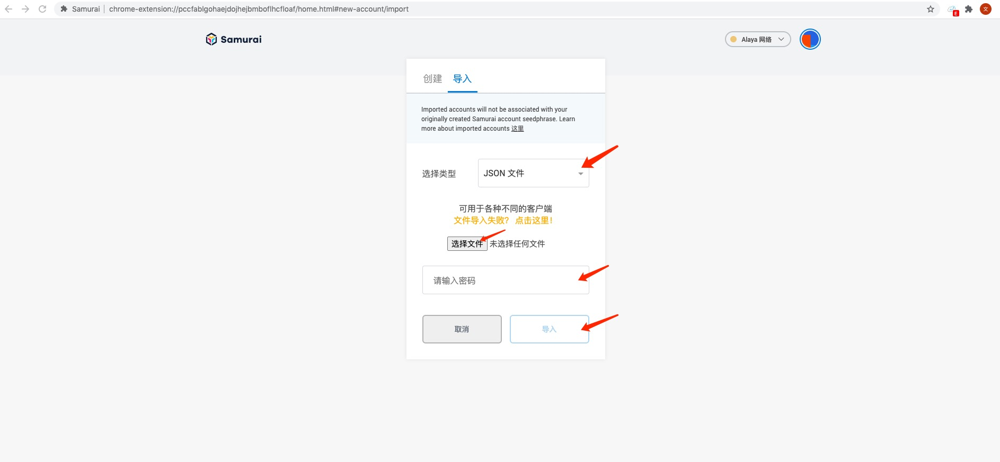

+ 进入主页点击右侧图标查看是否成功导入账户

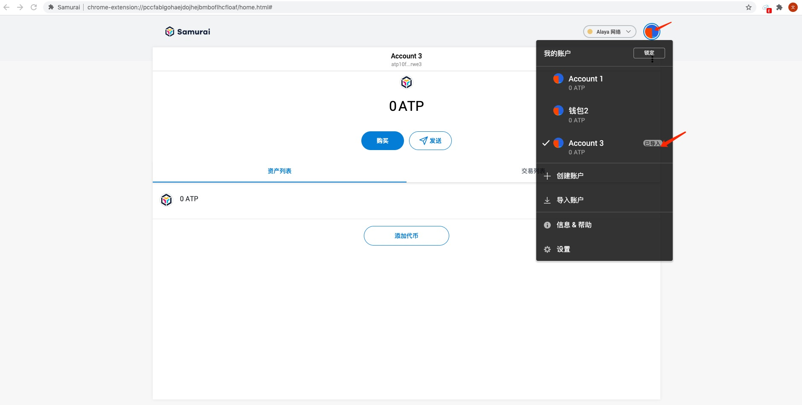

### 5. 语言切换

+ 点击samurai主页右侧小图标，然后点击**设置**

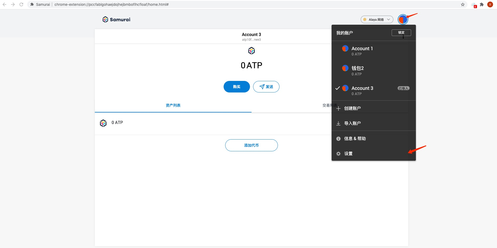

+ 进入设置主界面，然后点击**通用**-> 进入**当前语言**下拉框进行选择(支持多种语言)

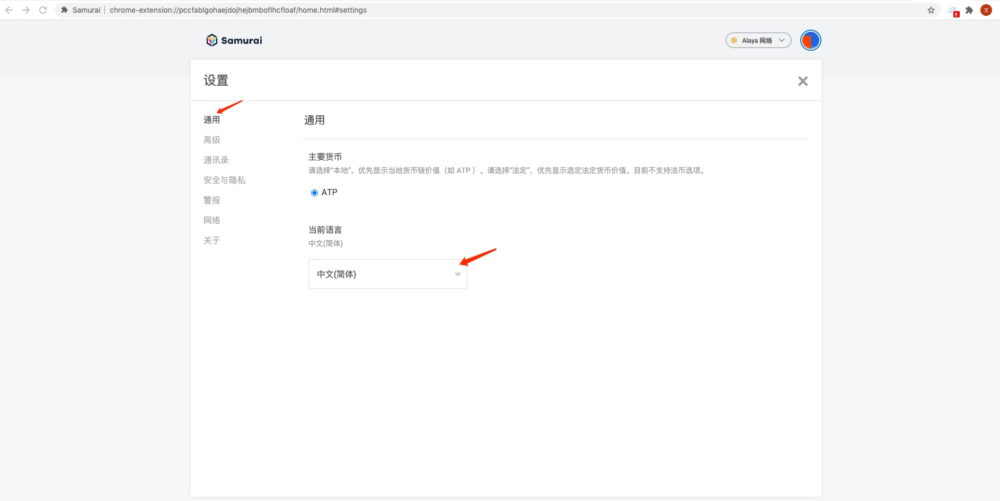

